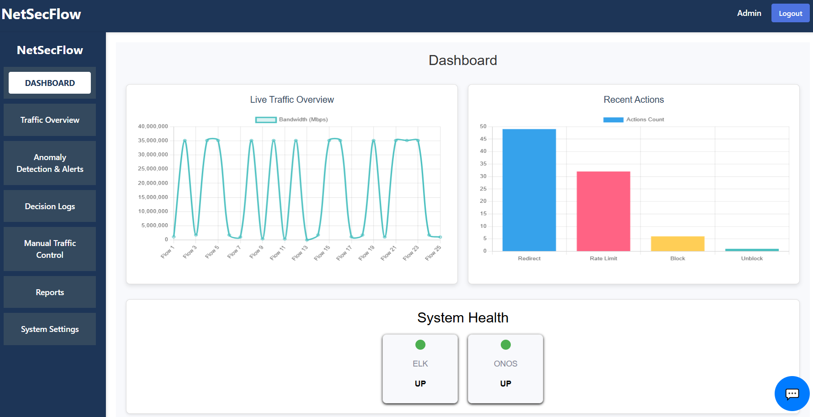
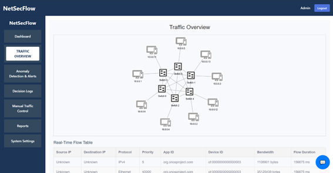
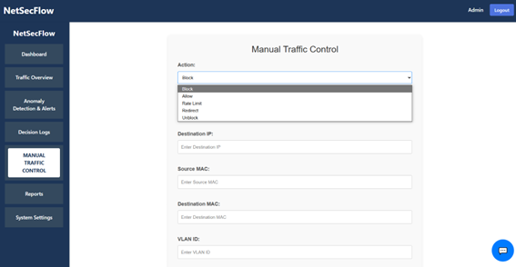
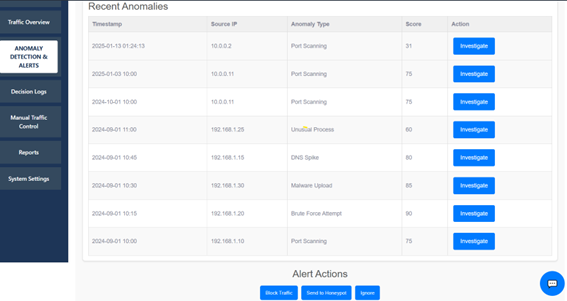
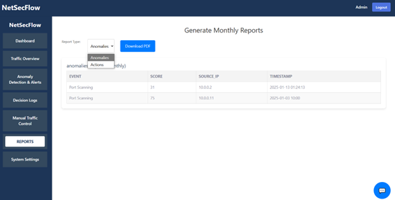
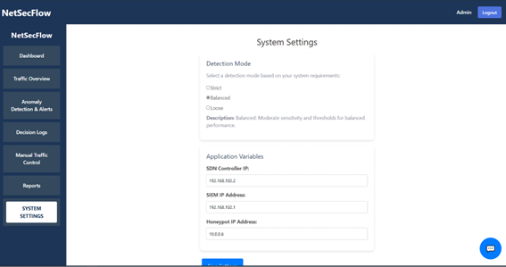
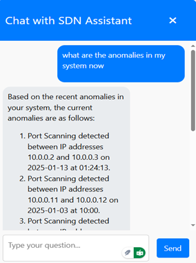

# NetSecFlow

NetSecFlow is an automated network security management system designed for Software-Defined Networking (SDN) environments. The project leverages real-time network telemetry, integrates with SIEM tools like ELK, and provides an intuitive dashboard for administrators to perform traffic control actions such as blocking, redirecting, rate limiting, and rerouting traffic.

---

## Table of Contents
- [NetSecFlow](#netsecflow)
  - [Table of Contents](#table-of-contents)
  - [Project Structure](#project-structure)
    - [Frontend (`/frontend`)](#frontend-frontend)
    - [Backend (`/backend`)](#backend-backend)
    - [Database](#database)
  - [Deployment Instructions](#deployment-instructions)
    - [Prerequisites](#prerequisites)
    - [Frontend Deployment](#frontend-deployment)
    - [Backend Deployment](#backend-deployment)
  - [API Endpoints (Backend)](#api-endpoints-backend)
    - [Traffic Control](#traffic-control)
    - [Monitoring](#monitoring)
    - [Settings](#settings)
  - [System Overview](#system-overview)
  - [Demo/Example](#demoexample)
    - [Dashboard Overview](#dashboard-overview)
    - [Traffic Overview](#traffic-overview)
    - [Traffic Control Page](#traffic-control-page)
    - [Anomaly Detection](#anomaly-detection)
    - [Logs and Reports](#logs-and-reports)
    - [Settings](#settings-1)
    - [Chatbot Assistant](#chatbot-assistant)
  - [Contribution](#contribution)
  - [License](#license)

---

## Project Structure

### Frontend (`/frontend`)
The frontend of the project is developed using React.js. It provides the user interface for the NetSecFlow system, including:
- Dashboard for monitoring traffic and anomalies.
- Traffic control actions (e.g., Block, Allow, Rate Limit, Redirect).
- Real-time anomaly detection logs.
- A chatbot assistant to guide administrators.
- Configurable settings page.

### Backend (`/backend`)
The backend is built using Python and Flask. It provides RESTful APIs to:
- Manage traffic control actions (Block, Allow, Redirect, Rate Limit).
- Communicate with the ONOS SDN controller and ELK stack.
- Fetch and log network flows.
- Integrate anomaly detection and response mechanisms.

Key backend files:
- `run.py`: The main Flask application managing the RESTful APIs.
- `controller_actions.py`: Contains functions to interact with the ONOS SDN controller for traffic control.
- `reception.py`: Handles incoming alerts and applies decision-making logic.
- `query_elastic.py`: Fetches and processes data from Elasticsearch.
- `database.py`: Handles database interactions to log actions, settings, and anomalies.

### Database
The database stores:
- System settings (e.g., SDN controller IP, Honeypot IP).
- Action logs (e.g., block, redirect, rate-limit actions).
- Anomaly detection logs.
- User-defined rules and preferences.

SQLite is used for local development. For production, you can use PostgreSQL or MySQL.

---

## Deployment Instructions

### Prerequisites
1. **Node.js and npm**: Required for the frontend.
   - Install from [Node.js Official Website](https://nodejs.org/).
2. **Python 3.8+**: Required for the backend.
3. **Virtual Environment**: For Python dependencies.
4. **Elasticsearch and Kibana**: For SIEM functionality.
5. **ONOS SDN Controller**: For SDN management.

---

### Frontend Deployment

1. Navigate to the frontend directory:
   ```bash
   cd frontend
2. Install the required Node modules:
    ```bash
   npm install
3. Start the development server:
    ```bash   
   npm start
4. Access the frontend at http://localhost:3000
5. To build for production
    ```bash   
   npm run build
### Backend Deployment
1. Navigate to the backend directory:
    ```bash
    cd backend
2. Create and activate a virtual environment:
    ```bash
    python3 -m venv venv
    source venv/bin/activate   # On Windows, use `venv\Scripts\activate`
3. Install the required Python dependencies:
    ```bash
    pip install -r requirements.txt
4. Set up the database (if using SQLite):
Ensure the database schema matches the backend's database calls. Can call the init_db() in database.py.

5. Run the Flask application:
    ```bash
    python run.py
6. Access the backend at http://localhost:5000

## API Endpoints (Backend)

### Traffic Control
- **Block Traffic**: `POST /api/block`
- **Allow Traffic**: `POST /api/allow`
- **Rate Limit Traffic**: `POST /api/rate-limit`
- **Redirect Traffic**: `POST /api/redirect`
- **Unblock Traffic**: `POST /api/unblock`

### Monitoring
- **Get Topology**: `GET /api/topology`
- **Get Flows**: `GET /api/get-flows`
- **Get Anomalies**: `GET /api/get-anomalies`
- **Get Actions**: `GET /api/get-actions`

### Settings
- **Save Settings**: `POST /api/save-settings`
- **Get Settings**: `GET /api/get-settings`

---

## System Overview
- **Frontend**: Provides an intuitive interface for administrators to monitor and control network traffic.
- **Backend**: Implements decision-making logic, communicates with ONOS and ELK, and provides APIs for the frontend.
- **Database**: Stores action logs, anomalies, and user configurations.
- **SDN Controller (ONOS)**: Manages the network flows and devices.
- **SIEM (Elasticsearch & Kibana)**: Handles threat detection and analysis.

---

## Demo/Example

Below are some screenshots demonstrating the key functionality of the NetSecFlow system:

### Dashboard Overview
*View the overall system health, traffic statistics, and security insights.*



### Traffic Overview
*View the traffic details in SDN.*



### Traffic Control Page
*Manage network traffic actions such as block, allow, rate-limit, and redirect.*



### Anomaly Detection
*Identify and respond to anomalies detected in the network.*



### Logs and Reports
*View detailed logs and generate reports for audit and compliance.*



### Settings 
*Modify some settings of the system*



### Chatbot Assistant
*Interact with the chatbot assistant for guidance and system queries.*



---

## Contribution
Contributions are welcome! Feel free to fork this repository, submit issues, or open pull requests.

---

## License
This project is licensed under the MIT License.
